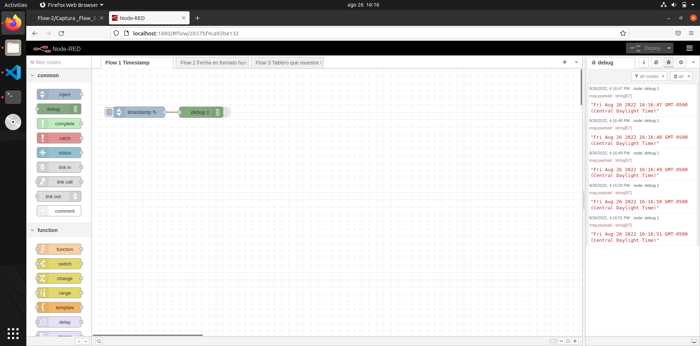

# Flow-2
En este repositorio se encuentra explicado el ejecicio 2 realizado en Node Red, el cual consiste en observar la fecha y hora cada segundo en un formato legible.

## Material necesario
Para poder realizar necesario es necesario tener instalado:
- [Node.js](https://github.com/nodesource/distributions/blob/master/README.md) Usar la versión LTS v16x e instalar los build tools.
- [Node-Red](https://nodered.org/docs/getting-started/local)
- [Ubuntu 20.04](https://ubuntu.com/download/desktop/thank-you?version=20.04.2.0&architecture=amd64)

## Material de referencia
Para hacer las instalaciones requeridas para este ejercicio se siguieron los pasos de los cursos siguientes:
- [Instalación de Ubuntu 20.04 en VirtualBox Windows](https://edu.codigoiot.com/course/view.php?id=812)
- [Instalación de NodeRed en Ubuntu 20.04](https://edu.codigoiot.com/course/view.php?id=817)
- [Introducción a NodeRed](https://edu.codigoiot.com/course/view.php?id=278)

## Instrucciones
1. Abrir la terminal y escribir el siguiente comando: **node-red**.
>Nota: Es importante escribir este comando en la terminal ya que si no se hace no se podrá trabajar con Node Red.
2. En el navegador escribir: **localhost:1880**, se abrirá Node Red.
3. Colocar el bloque de **inject** y el bloque de **debug**. 
4. Dar doble click al bloque de **inject** y en donde dice "repeat" seleccionar la opción de *interval* y colocar un tiempo de un segundo.
5. Agregar un bloque **function** y copiar el siguiente código:
>var date = new Date(msg.payload);
>msg.payload = date.toString();
>return msg;
6. Una vez copiado dar click en el botón **Done**.
7. Unir el bloque **function** con el bloque **inject** y el bloque **debug**.
5. Finalmente, dar click en el botón **Deploy** para que se actualicen los cambios. 

## Resultados
Una vez completados los pasos anteriores se deberá ver una ventana que cada segundo se estará actualizando, como se muestra a continuación:

## Evidencias
[Evidencia Flow 2](https://youtu.be/qwmD1mZGj_I)

## Créditos
Este ejercicio fue basado en los ejercicios que se encuentran en el repositorio [flow2-NodeRed](https://github.com/hugoescalpelo/Flow2-NodeRed)

Documentación realizada por [Karen Rosas](https://github.com/KarenRosas49)